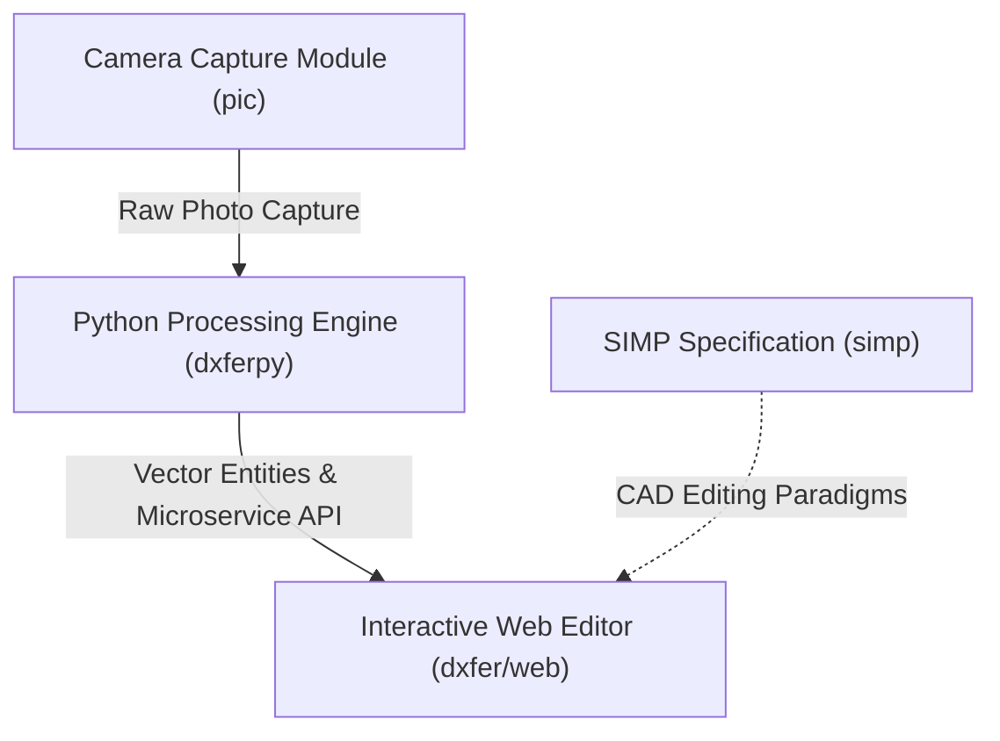

# 00 - Project Overview & System Architecture

## 1. Executive Summary

**DXFify** (internal codebase reference `dxfer`) is an end-to-end computer-vision-assisted CAD vectorization platform. The core goal of the project is to convert physical objects placed on a calibrated paper sheet into metrically accurate, 1:1 scale DXF (Drawing Exchange Format) vector files suitable for digital manufacturing processes such as laser cutting, CNC milling, and 3D printing.

Existing automated raster-to-vector solutions (e.g. standard image trace tools) produce uncalibrated pixel shapes with wobbly edges, improper curve approximations, and lack metric scale calibration. DXFify bridges the gap between physical measurement and CAD modeling by combining:
1. **Fiducial Metric Calibration**: ArUco markers of known physical dimensions establishing top-down metric perspective transforms.
2. **Deep Learning Object Segmentation**: Pre-trained neural networks (BiRefNet) performing background subtraction resilient to shadows and complex surface textures.
3. **Geometric CAD Vectorization Engine**: Algorithms that enforce straight line snapping, orthogonal angle constraints (Manhattan-world assumptions), circle fitting, arc extraction, and multi-layer CAD exports (`OUTER`, `HOLES`, `DETAILS`).
4. **Interactive Web CAD Workspace**: A high-performance browser interface built with React, Three.js, and WebGL allowing manual CAD editing, measurement, alignment, and multi-strategy vector reprocessing.
5. **Standalone Native Desktop Executable**: A self-contained desktop application (`desktop/`) bundling the Python processing engine, embedded server, RAM ONNX model caching, and native `pywebview` application window with zero external web browser dependencies.

```
┌─────────────────────────────────────────────────────────────────────────────┐
│                           SYSTEM PIPELINE OVERVIEW                           │
└─────────────────────────────────────────────────────────────────────────────┘
  ┌──────────────────┐      ┌─────────────────────────┐      ┌──────────────────────────────┐
  │  Physical Setup  │ ───► │  Python Processing Core │ ───► │ Web Dashboard & Desktop App  │
  │ (Object + ArUco) │      │      (dxferpy)          │      │  (dxfer/web & dxfer/desktop) │
  └──────────────────┘      └─────────────────────────┘      └──────────────────────────────┘
            │                            │                                  │
  • Camera capture (pic)       • BiRefNet segmentation            • 100% Web UI & Feature Parity
  • 4x ArUco markers           • Perspective correction           • Standalone binary (dist/dxfify)
  • A4/A3/Custom paper         • Vectorization & snapping         • RAM model cache (<1.5s conversion)
                               • DXF export generation            • Chromium GPU acceleration
```


---

## 2. Problem Statement & Motivation

In rapid prototyping and mechanical design, reverse-engineering existing physical components (e.g., custom gaskets, replacement brackets, mounting plates, phone cases) requires manual measurement with calipers or high-end 3D laser scanners.
- **Manual Caliper Drafting**: Time-consuming, prone to human error, and difficult for complex organic or multi-curved profiles.
- **Standard Flatbed Scanners**: Limited by bed size, shallow depth of field, and inability to handle thick physical objects.
- **Uncalibrated Photography**: Photographs taken with mobile devices or webcams suffer from severe perspective distortion (keystoning) and lack real-world unit scaling (pixels to millimeters).

DXFify solves these challenges by turning standard 2D photographs captured via mobile phones or embedded cameras into 1:1 metric CAD drawings in seconds.

---

## 3. Modular Architecture Overview

The master project space (`/home/aledawizard/Files/Work/Internships/orange/code/project/`) consists of three primary modules:



### Module 1: `pic` (Camera Interface)
- **Role**: Embedded hardware image capture interface.
- **Tech Stack**: C++, CMake, Raspberry Pi Camera API (`rpi-cam-still`).
- **Function**: Triggers high-resolution photo acquisition from a dedicated Raspberry Pi camera rig with automated white balance (`--awb auto`) and high-quality denoiser (`--denoise cdn_hq`).

### Module 2: `dxferpy` (Python Processing Engine)
- **Role**: Core computer vision, deep learning segmentation, and vectorization microservice.
- **Tech Stack**: Python 3, OpenCV (`cv2`), `rembg` (BiRefNet General Lite), `ezdxf`, `numpy`, `scipy`, Flask.
- **Function**: Runs image perspective correction via 4-point ArUco homography, executes deep-learning-based background removal, filters contours into outer and hole hierarchies, applies orthogonal line snapping and curve fitting, and outputs `ezdxf` drawing files alongside debug overlays.

### Module 3: `dxfer/web` (Interactive Web CAD Dashboard)
- **Role**: Single-page web application providing visualization, manual CAD editing, measurement, and reprocessing controls.
- **Tech Stack**: React 18, TypeScript, Vite, Three.js, Express.js.
- **Function**: Displays synchronized side-by-side DXF vector previews and camera overlay inspection tabs; provides 25 specialized CAD editing tools (fillet, chamfer, spline, brush deformation, alignment); handles client-side DXF, SVG, and PDF exports.

---

## 4. Master Technology Stack

| Layer | Component | Technology / Library | Purpose |
| :--- | :--- | :--- | :--- |
| **Hardware / Capture** | `pic/` | C++17, CMake, `rpi-cam-still` | High-quality image acquisition on embedded hardware |
| **Segmentation** | Backend | BiRefNet General Lite via `rembg` / ONNX Runtime | Deep-learning boundary extraction resilient to complex backgrounds |
| **Computer Vision** | Backend | OpenCV (`cv2.aruco`, `cv2.ximgproc`) | ArUco detection, homography matrix calculation, guided filtering |
| **Vectorization** | Backend | NumPy, SciPy (`splprep`), custom geometry algorithms | Douglas-Peucker simplification, 180° direction histograms, Pratt circle fitting |
| **CAD Export** | Backend | `ezdxf` (R2010 standard) | Structured multi-layer ASCII DXF file generation |
| **Microservice API** | Backend | Flask (port `8788`) | Preloaded model worker serving `/process` and `/process_region` endpoints |
| **Web Server Bridge** | Frontend | Express.js (port `8787`), Multer | File upload handling, job directory isolation, API proxying |
| **Web Client** | Frontend | React 18, TypeScript 5.7, Vite 6 | Desktop-class responsive UI layout and state management |
| **CAD Rendering** | Frontend | Three.js (WebGL), Native SVG | Dual WebGL vector viewport and interactive overlay renderer |

---

## 5. System Data Flow

```mermaid
sequenceDiagram
    autonumber
    actor User
    participant Frontend as Web Client (React/Three.js)
    participant Bridge as Express Server (8787)
    participant Worker as Flask Worker (8788)
    participant Engine as Python CV Pipeline

    User->>Frontend: Upload image or trigger capture
    Frontend->>Bridge: POST /api/convert (FormData + Parameters)
    Bridge->>Worker: POST /process (JSON parameters + paths)
    Worker->>Engine: Run CV Pipeline (Homography, BiRefNet, Vectorize)
    Engine--►Worker: Return DXF file, PNG overlays & JSON report
    Worker--►Bridge: Return execution summary
    Bridge--►Frontend: Return jobId & artifact URLs
    Frontend->>User: Display synchronized CAD viewport & image inspector
```

---

## 6. Document Suite Index

This report is part of a 10-part technical documentation suite located in `/reports/`:

- **`00_project_overview.md`**: Executive summary, system architecture, module relationships, and master tech stack.
- **`01_computer_vision_pipeline.md`**: ArUco detection, homography perspective correction, BiRefNet segmentation, and edge refinement algorithms.
- **`02_vectorization_engine.md`**: Polygon simplification, orthogonal angle snapping, curve fitting strategies, and DXF assembly.
- **`03_web_application.md`**: Web editor architecture, React state flow, Three.js CAD rendering, and API bridge design.
- **`04_coordinate_systems.md`**: Mathematical derivations of coordinate spaces (DXF model, SVG pixels, camera frame) and matrix transformation proofs.
- **`05_cad_tools.md`**: Technical specification of all 25 CAD tools, brush deformation math, and export generators.
- **`06_calibration_system.md`**: Metric calibration targets, printer margin factor, scale calculation, and error metrics.
- **`07_development_timeline.md`**: Chronological evolution from initial C++ prototype through Python vector engine to full Web CAD editor.
- **`08_bugs_and_fixes.md`**: Deep post-mortem of major engineering challenges, root causes, and mathematical fixes.
- **`09_internship_report_strategy.md`**: Strategy for assembling these technical reports into the final university internship thesis.
