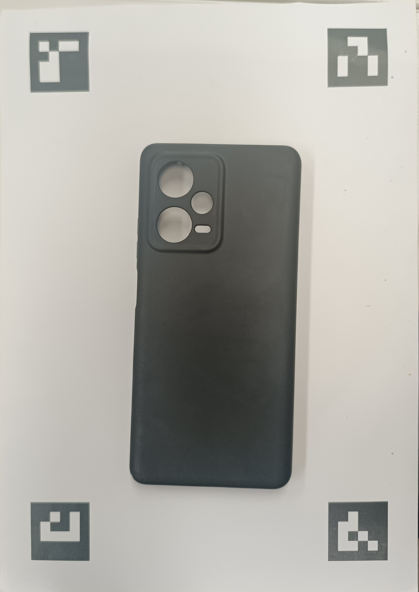
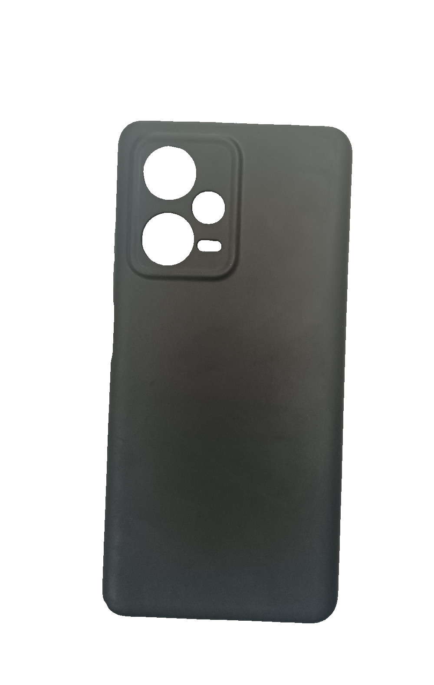

# 01 - Computer Vision & Image Processing Pipeline

## 1. Pipeline Overview

The computer vision pipeline in **`dxferpy`** (located at `/home/aledawizard/Files/Work/Internships/orange/code/project/dxfer/dxferpy/`) converts uncalibrated input photographs into metrically scaled, perspective-corrected planar binary representations. 

```
  ┌─────────────────┐
  │   Input Image   │
  └────────┬────────┘
           │
           ▼
  ┌─────────────────┐      ┌─────────────────────────┐
  │ ArUco Marker    │ ───► │  3x3 Homography Matrix  │
  │   Detection     │      │   Calculation & Warp    │
  └─────────────────┘      └────────────┬────────────┘
                                        │
                                        ▼
                           ┌─────────────────────────┐
                           │ Deep Learning Seg.      │
                           │ (BiRefNet General Lite) │
                           └────────────┬────────────┘
                                        │
                                        ▼
                           ┌─────────────────────────┐
                           │ Edge Refinement         │
                           │ (Guided Filter + Erode) │
                           └────────────┬────────────┘
                                        │
                                        ▼
                           ┌─────────────────────────┐
                           │ ArUco Region Clearing   │
                           │ (Mask Zeroing)          │
                           └────────────┬────────────┘
                                        │
                                        ▼
                           ┌─────────────────────────┐
                           │ Refined Rectified Mask  │
                           └─────────────────────────┘
```

---

## 2. ArUco Marker Detection & Ordering

Metric calibration relies on four planar ArUco square synthetic markers from the **`DICT_4X4_50`** dictionary placed near the four corners of a target calibration sheet (e.g., A4 paper: $210 \times 297\text{ mm}$).

### Marker ID Map
- **ID 0**: Bottom-Right corner ($\approx [177.8, 34.2]\text{ mm}$)
- **ID 1**: Bottom-Left corner ($\approx [32.2, 34.2]\text{ mm}$)
- **ID 2**: Top-Left corner ($\approx [32.2, 262.8]\text{ mm}$)
- **ID 3**: Top-Right corner ($\approx [177.8, 262.8]\text{ mm}$)

### Detection Logic (`segment_object.py` & `vectorize_smart.py`)
Detection is implemented via OpenCV's `cv2.aruco.ArucoDetector`:

```python
dictionary = cv2.aruco.getPredefinedDictionary(cv2.aruco.DICT_4X4_50)
parameters = cv2.aruco.DetectorParameters()
detector = cv2.aruco.ArucoDetector(dictionary, parameters)
corners, ids, rejected = detector.detectMarkers(gray_img)
```

Each marker yields four pixel corner coordinates. The center point $(c_x, c_y)$ of each detected marker is computed via arithmetic mean:

$$c_x = \frac{1}{4}\sum_{i=0}^3 x_i, \quad c_y = \frac{1}{4}\sum_{i=0}^3 y_i$$

The marker centers are sorted by their integer IDs $[0, 1, 2, 3]$ to guarantee deterministic spatial correspondence regardless of camera orientation.

---

## 3. Planar Perspective Homography Calibration

A 2D perspective transform (homography) maps points from an arbitrary 3D camera view of a planar surface to a canonical top-down 2D coordinate system.

### Mathematical Formulation
Given a set of 4 source points $(x_i, y_i)$ in the camera image (detected marker centers in pixels) and 4 destination points $(u_i, v_i)$ in physical world space (target marker locations in millimeters scaled by resolution factor $S = 10.0\text{ px/mm}$):

Expanding into homogeneous coordinates yields two independent linear equations per point pair:

$$u_i = \frac{h_{11}x_i + h_{12}y_i + h_{13}}{h_{31}x_i + h_{32}y_i + h_{33}}, \quad v_i = \frac{h_{21}x_i + h_{22}y_i + h_{23}}{h_{31}x_i + h_{32}y_i + h_{33}}$$

Setting $h_{33} = 1$, the $3 \times 3$ matrix $\mathbf{H}$ (8 degrees of freedom) is solved uniquely using OpenCV's Direct Linear Transformation (DLT) solver:

```python
H = cv2.getPerspectiveTransform(src_corners, dst_corners)
warped_img = cv2.warpPerspective(img, H, (out_width_px, out_height_px))
```

### Destination Resolution Scaling
- Default working scale factor: $S = 10.0\text{ pixels per mm}$.
- For A4 paper ($210 \times 297\text{ mm}$), output warped dimensions are $2100 \times 2970\text{ pixels}$.
- This guarantees $0.1\text{ mm/pixel}$ baseline spatial precision.

---

## 4. Deep Learning Object Segmentation (BiRefNet)

Traditional thresholding (e.g. Otsu, adaptive Canny) fails when objects share color similarities with paper, suffer from strong specular highlights, or cast dark drop shadows. To achieve industrial robustness, DXFify incorporates **BiRefNet** (Bilateral Reference Network for High-Resolution Dichotomous Image Segmentation).



```
Input Warped RGB (2100x2970)
        │
        ▼
   Rembg Session (BiRefNet General Lite ONNX)
        │
        ▼
  Alpha Probability Map (0.0 to 1.0)
        │
        ▼
   Thresholding (alpha >= mask_threshold / 255)
        │
        ▼
   Initial Binary Mask {0, 255}
```


### Preloading Optimization (`pipeline_worker.py`)
To prevent model loading overhead on every conversion request, the ONNX session is preloaded into CPU RAM upon worker startup:

```python
import rembg
session = rembg.new_session("birefnet-general-lite")
output_rgba = rembg.remove(warped_img, session=session)
alpha_mask = output_rgba[:, :, 3]
```

This reduces per-image inference time from $\approx 4.5\text{ seconds}$ to $\approx 600\text{ milliseconds}$.

---

## 5. Edge Refinement & Morphological Filtering

Raw alpha masks from deep learning models can exhibit soft or feathered edges. A multi-stage post-processing pipeline sharpens boundaries:

### 1. Binarization
The continuous alpha map is thresholded at `mask_threshold` (configurable parameter, default 240/255):
$$\mathbf{B}_{init}(x,y) = \begin{cases} 255 & \text{if } \mathbf{A}(x,y) \ge \text{mask\_threshold} \\ 0 & \text{otherwise} \end{cases}$$


### 2. Guided Filter Edge Smoothing
OpenCV's Domain Transform Guided Filter (`cv2.ximgproc.guidedFilter`) preserves sharp physical object edges while filtering high-frequency boundary jitter:
```python
refined_mask = cv2.ximgproc.guidedFilter(
    guide=warped_gray,
    src=binary_mask,
    radius=4,
    eps=1e-4
)
```

### 3. Morphological Erosion
To compensate for slight neural network boundary inflation, a morphological erosion kernel is applied:
```python
kernel = cv2.getStructuringElement(cv2.MORPH_RECT, (erosion_kernel, erosion_kernel))
final_mask = cv2.erode(refined_mask, kernel, iterations=1)
```



---

## 6. ArUco Marker Region Clearing

Because the four printed ArUco markers are present on the calibration sheet alongside the target physical object, they would naturally register as binary shapes and generate unwanted outer CAD entities.

To eliminate marker interference without altering object geometry, circular zeroing masks are stamped around each marker center:

```python
for pt in marker_centers_mm:
    cx_px = int(pt[0] * scale)
    cy_px = int(pt[1] * scale)
    radius_px = int(marker_clear_radius_mm * scale) # Default 22 mm -> 220 px
    cv2.circle(final_mask, (cx_px, cy_px), radius_px, 0, -1) # Fill black (0)
```

```
   ┌─────────────────────────────────────────────────────────────┐
   │ Rectified Mask                                              │
   │   (0) Marker Cleared ◯                   (3) Marker Cleared ◯│
   │                                                             │
   │                        ┌───────────┐                        │
   │                        │ Physical  │                        │
   │                        │ Object    │                        │
   │                        └───────────┘                        │
   │                                                             │
   │   (1) Marker Cleared ◯                   (2) Marker Cleared ◯│
   └─────────────────────────────────────────────────────────────┘
```

The resulting refined binary mask $\mathbf{M}_{final}$ serves as the clean input to the geometric vectorization engine documented in `02_vectorization_engine.md`.
