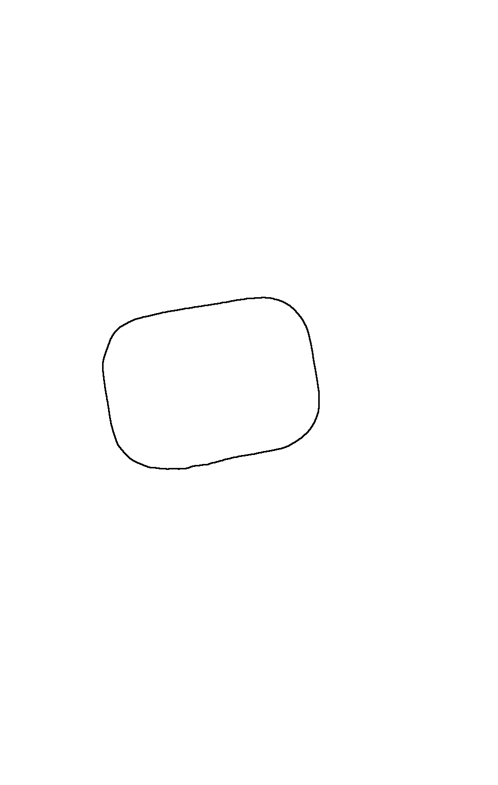
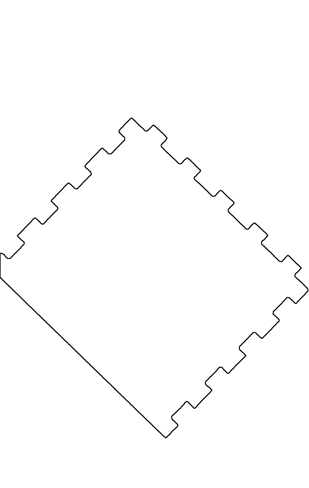

# 02 - Contour Vectorization & CAD Entity Generation Engine

## 1. Engine Overview

The vectorization engine in `dxferpy/vectorize_smart.py` converts a refined binary mask into a structured CAD entity tree (`CIRCLE`, `LWPOLYLINE`) classified across standardized CAD layers (`OUTER`, `HOLES`, `DETAILS`).

```
┌─────────────────────┐
│ Refined Binary Mask │
└──────────┬──────────┘
           │
           ▼
┌──────────────────────────────────────────────┐
│ Two-Level Contour Extraction (RETR_CCOMP)    │
├──────────────────────┬───────────────────────┤
│ Outer Boundaries     │ Interior Cutout Holes │
│ (hierarchy[3] == -1) │ (hierarchy[3] != -1)  │
└──────────┬───────────┴───────────┬───────────┘
           │                       │
           ▼                       ▼
┌──────────────────────────────────────────────┐
│ Circle Detection vs. Polygon Simplification  │
├──────────────────────────────────────────────┤
│ • Minimum Enclosing Circle Ratio > 0.85      │
│ • Douglas-Peucker Polyline Simplification    │
└──────────────────────────┬───────────────────┘
                           │
                           ▼
┌──────────────────────────────────────────────┐
│ Orthogonal Line Snapping & Angle Alignment   │
├──────────────────────────────────────────────┤
│ • 180° Weighted Direction Histogram          │
│ • 5-tap Gaussian Histogram Smoothing         │
│ • Dominant Angle Extraction & Snapping       │
│ • Adjacent Line Segment Intersection         │
└──────────────────────────┬───────────────────┘
                           │
                           ▼
┌──────────────────────────────────────────────┐
│ Advanced Curve Fitting Strategies (Optional)  │
├──────────────────────────────────────────────┤
│ • Pratt Algebraic Circle Fitting             │
│ • Cubic B-Spline Interpolation (Scipy)        │
│ • RANSAC Line & Automatic Fillet Arcs        │
└──────────────────────────┬───────────────────┘
                           │
                           ▼
┌──────────────────────────────────────────────┐
│ Detail Engraving Extraction (Adaptive Canny)  │
└──────────────────────────┬───────────────────┘
                           │
                           ▼
┌──────────────────────────────────────────────┐
│ Metric Coordinate Transformation & DXF Save  │
└──────────────────────────────────────────────┘
```

---

## 2. Hierarchical Contour Classification

Contours are extracted using OpenCV's `cv2.findContours` under the `cv2.RETR_CCOMP` (Component Hierarchy) retrieval mode and `cv2.CHAIN_APPROX_NONE` point preservation:

```python
contours, hierarchy = cv2.findContours(mask, cv2.RETR_CCOMP, cv2.CHAIN_APPROX_NONE)
```

### Hierarchy Structure
The `hierarchy` array returns 4 integer indices per contour: `[Next, Previous, First_Child, Parent]`.
- **Outer Outer Boundaries**: `hierarchy[0][i][3] == -1` (No parent contour). Filtered by `min_outer_area` (default 100 px²). Assigned to CAD layer **`OUTER`** (Color 7 / White).
- **Interior Cutouts / Holes**: `hierarchy[0][i][3] != -1` (Enclosed within an outer boundary). Filtered by `min_hole_area` (default 500 px²). Assigned to CAD layer **`HOLES`** (Color 1 / Red).

---

## 3. Circle Detection & Polyline Simplification

Before treating contours as piecewise-linear polygons, each contour is evaluated to determine if it represents a pure circle (e.g. mounting bolt holes, circular cutouts).

### Circle Classification (`circle_ratio`)
1. Compute the minimum enclosing circle radius $R$ and center $(C_x, C_y)$ via `cv2.minEnclosingCircle`.
2. Compute actual contour area $A_{contour}$ and theoretical enclosing circle area $A_{circle} = \pi R^2$.
3. Compute circularity ratio:
$$\rho = \frac{A_{contour}}{\pi R^2}$$

If $\rho \ge \text{circle\_ratio}$ (default 0.85), the contour is immediately classified as a CAD **`CIRCLE`** entity defined by center $(C_x, C_y)$ and radius $R$, skipping polygon simplification entirely.

```
            Contour Area
Circle Ratio = ───────────────────── ───►  If ≥ 0.85  ───► CAD CIRCLE
               π × (Circle Radius)²
```

### Douglas-Peucker Polyline Simplification
For general contours, raw pixel boundary points are simplified using the Ramer-Douglas-Peucker (RDP) algorithm:

```python
perimeter = cv2.arcLength(contour, True)
epsilon = np.clip(0.003 * perimeter, epsilon_min, epsilon_max)
approx = cv2.approxPolyDP(contour, epsilon, True)
```

`epsilon` specifies the maximum perpendicular distance allowed between the original contour and the simplified polyline segment.

---

## 4. Orthogonal Line Snapping & Direction Histograms

Objects with manufactured right angles (e.g. rectangular plates, mounting brackets) often suffer from pixel staircase noise, causing nominally 90° edges to tilt by $1^\circ \text{-- } 5^\circ$. To enforce crisp CAD geometry, `dxferpy` implements a 180° direction histogram snapping algorithm.

### Algorithm Steps (`vectorize_smart.py`)

1. **Segment Orientation Extraction**:
   For each line segment $(P_i, P_{i+1})$ in the simplified polyline, calculate length $L_i$ and angle $\theta_i \in [0^\circ, 180^\circ)$:
   $$\theta_i = \text{atan2}(y_{i+1} - y_i, x_{i+1} - x_i) \pmod{\pi}$$

2. **Weighted Histogram Construction**:
   Accumulate segment lengths into a 180-bin histogram $\mathbf{H}[\lfloor \theta_i \rfloor] += L_i$. Longer lines contribute higher weight to dominant orientation selection.

3. **5-Tap Gaussian Histogram Smoothing**:
   To prevent single-bin discretization artifacts, smooth $\mathbf{H}$ with a 1D Gaussian kernel $[0.05, 0.25, 0.40, 0.25, 0.05]$:
   $$\mathbf{H}_{smooth}[\theta] = \sum_{k=-2}^2 w_k \cdot \mathbf{H}[(\theta + k) \pmod{180}]$$

4. **Dominant Peak Extraction**:
   Find the primary peak angle $\theta_{dom}$. Identify secondary orthogonal directions forced to $\theta_{dom} \pm 90^\circ$.

5. **Segment Snapping & Line Equations**:
   If a segment's angle lies within `snap_angle` (default $10^\circ$) of a dominant direction, project its vector onto the exact snapped angle $\theta_{snap}$.

6. **Adjacent Segment Intersection**:
   Recompute polyline vertices by solving the 2D linear intersection of adjacent snapped line equations:
   $$a_1 x + b_1 y = c_1, \quad a_2 x + b_2 y = c_2 \implies \begin{bmatrix} x \\ y \end{bmatrix} = \begin{bmatrix} a_1 & b_1 \\ a_2 & b_2 \end{bmatrix}^{-1} \begin{bmatrix} c_1 \\ c_2 \end{bmatrix}$$
   This eliminates rounded/mitered corner artifacts and produces perfectly sharp $90^\circ$ CAD corners.

---

## 5. Specialized Curve Fitting Strategies

When processing complex organic shapes or rounded corner fillets, standard linear polyline simplification can be augmented using selectable curve strategies (`curve_strategy` parameter):

| Strategy ID | Name | Mathematical Approach | Use Case |
| :--- | :--- | :--- | :--- |
| `current` | **Douglas-Peucker** | Ramer-Douglas-Peucker recursive split | Standard CAD polylines |
| `pratt` | **Pratt Circle Fit** | Algebraic least-squares circle fit via SVD | Corner radii & arcs |
| `spline` | **Cubic B-Spline** | Scipy `splprep` / `splev` parametric B-splines | Smooth organic boundaries |
| `gaussian` | **Gaussian Smoother** | 1D Gaussian spatial coordinate convolution | Low-noise smooth profiles |
| `ransac` | **RANSAC Fillet** | Iterative RANSAC line fitting + corner fillet arc solver | Machined parts with fillet radii |

### 1. Douglas-Peucker Perpendicular Distance
For each point $P_0(x_0, y_0)$ between segment endpoints $P_1(x_1, y_1)$ and $P_2(x_2, y_2)$, the perpendicular distance $d_{perp}$ is calculated as:
$$d_{perp} = \frac{|(y_2 - y_1)x_0 - (x_2 - x_1)y_0 + x_2 y_1 - y_2 x_1|}{\sqrt{(y_2 - y_1)^2 + (x_2 - x_1)^2}}$$
If $\max(d_{perp}) > \epsilon$, the contour is split recursively at the point of maximum deviation.

### 2. Pratt Algebraic Circle Fit (`fit_circle_pratt`)
Solves the algebraic circle equation $A(x^2 + y^2) + Bx + Cy + D = 0$ subject to constraint $B^2 + C^2 - 4AD = 1$.
Constructs design matrix $\mathbf{Z}$ for $N$ contour points:
$$\mathbf{Z}_i = \begin{bmatrix} x_i^2 + y_i^2 & x_i & y_i & 1 \end{bmatrix}$$
Solves generalized eigenvalue problem $\mathbf{M} \mathbf{A} = \lambda \mathbf{C} \mathbf{A}$ where $\mathbf{M} = \frac{1}{N} \mathbf{Z}^T \mathbf{Z}$ and constraint matrix $\mathbf{C}$:
$$\mathbf{C} = \begin{bmatrix} 0 & 0 & 0 & -2 \\ 0 & 1 & 0 & 0 \\ 0 & 0 & 1 & 0 \\ -2 & 0 & 0 & 0 \end{bmatrix}$$
Circle center $(c_x, c_y)$ and radius $r$ are extracted directly from eigenvector coefficients $\mathbf{A} = [A, B, C, D]^T$:
$$c_x = -\frac{B}{2A}, \quad c_y = -\frac{C}{2A}, \quad r = \frac{\sqrt{B^2 + C^2 - 4AD}}{2|A|}$$
This algebraic fit is completely immune to partial arc coverage, recovering exact CAD radii for rounded fillets.



### 3. RANSAC Line & Automatic Corner Fillet Solver (`ransac_line_fit`, `get_fillet_arc`)
- Iteratively samples candidate point pairs to find robust line equations $a x + b y + c = 0$ resilient to edge noise.
- Intersects adjacent RANSAC lines to establish sharp corner vertex $V$.
- Calculates fillet arc center $C$ and tangent points $T_1, T_2$ given fillet radius $R_{fillet}$ and corner interior angle $\theta_{corner}$:
  $$\phi = \frac{\pi - \theta_{corner}}{2}$$
  $$\text{Tangent Setback } d_{tangent} = \frac{R_{fillet}}{\tan\phi}, \quad \text{Arc Center Distance } d_{center} = \frac{R_{fillet}}{\sin\phi}$$
  $$C = V + d_{center} \cdot \hat{\mathbf{b}}$$
  where $\hat{\mathbf{b}}$ is the unit angle bisector vector pointing inward toward the fillet center.



---

## 6. Detail Engraving Extraction

For physical objects containing surface engravings, internal grooves, or text logos, enabling `detect_details` executes interior feature extraction:

1. Apply bilateral filtering (`cv2.bilateralFilter`) to the warped RGB image to smooth surface noise while preserving sharp internal contrast boundaries.
2. Construct an interior ROI mask by eroding outer boundary contours inward.
3. Compute adaptive dual Canny thresholds ($\tau_1, \tau_2$) using Otsu thresholding on interior pixel gradient magnitudes.
4. Run `cv2.Canny` and extract open polylines.
5. Assign extracted features to CAD layer **`DETAILS`** (Color 3 / Green).

---

## 7. Metric DXF Assembly & Layer Structuring

The final step converts image pixel coordinates $(x_{px}, y_{px})$ to real-world millimeter coordinates $(X_{mm}, Y_{mm})$:

### Metric Coordinate Conversion
$$X_{mm} = \frac{x_{px}}{S}, \quad Y_{mm} = \frac{\text{height}_{px} - y_{px}}{S}$$

*Note*: The Y-axis inversion ($\text{height}_{px} - y_{px}$) reconciles computer vision image space (origin top-left, Y pointing down) with standard Cartesian CAD model space (origin bottom-left, Y pointing up).

### DXF File Construction (`ezdxf`)
Using `ezdxf` (AutoCAD R2010 standard), a clean, lightweight ASCII DXF document is assembled:

```python
doc = ezdxf.new('R2010')
msp = doc.modelspace()

# Create standardized layers
doc.layers.new(name='OUTER', dxfattribs={'color': 7})   # White
doc.layers.new(name='HOLES', dxfattribs={'color': 1})   # Red
doc.layers.new(name='DETAILS', dxfattribs={'color': 3}) # Green

# Append entities
for entity in entities:
    if entity.type == 'circle':
        msp.add_circle((entity.cx, entity.cy), entity.r, dxfattribs={'layer': entity.layer})
    elif entity.type == 'polyline':
        msp.add_lwpolyline(entity.points, is_closed=entity.closed, dxfattribs={'layer': entity.layer})

doc.saveas(output_dxf_path)
```
