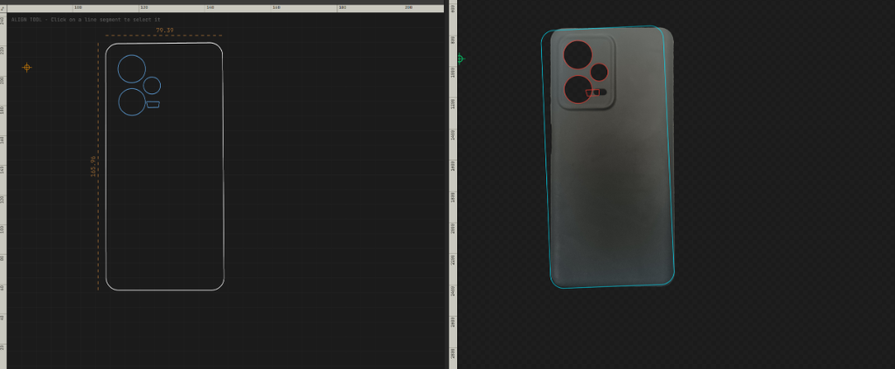
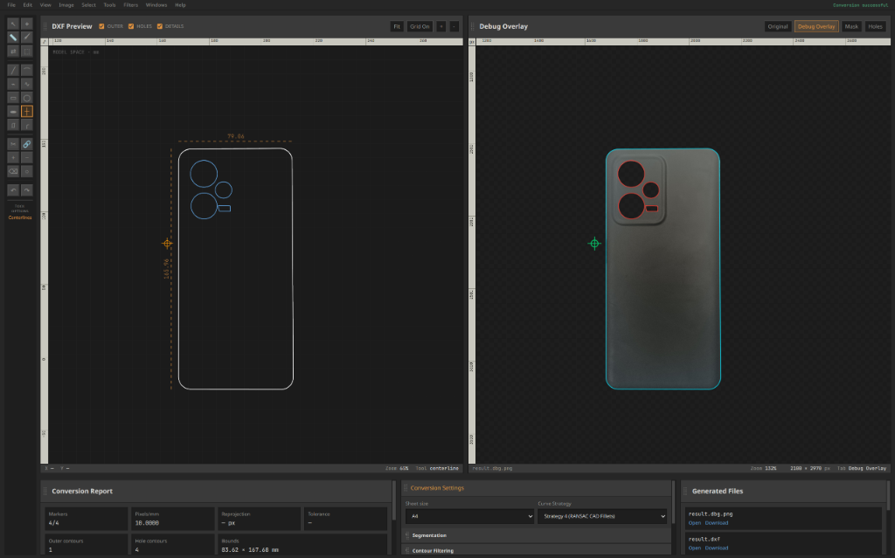
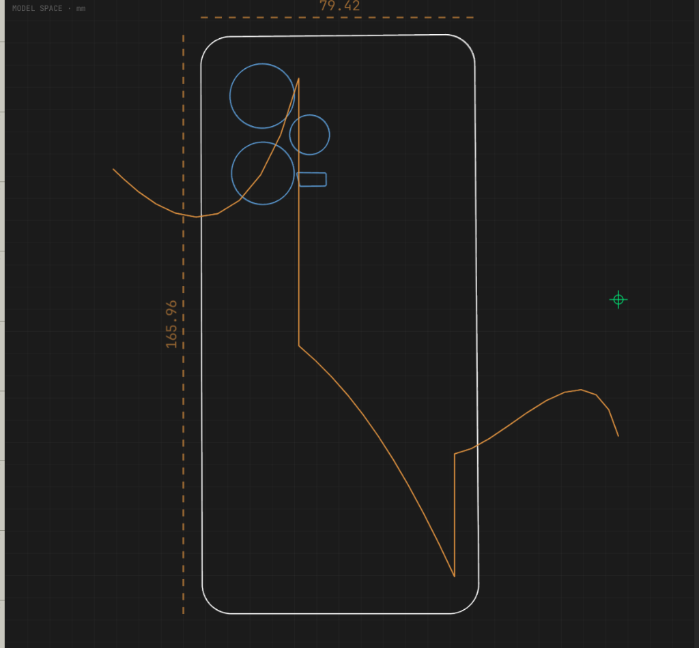
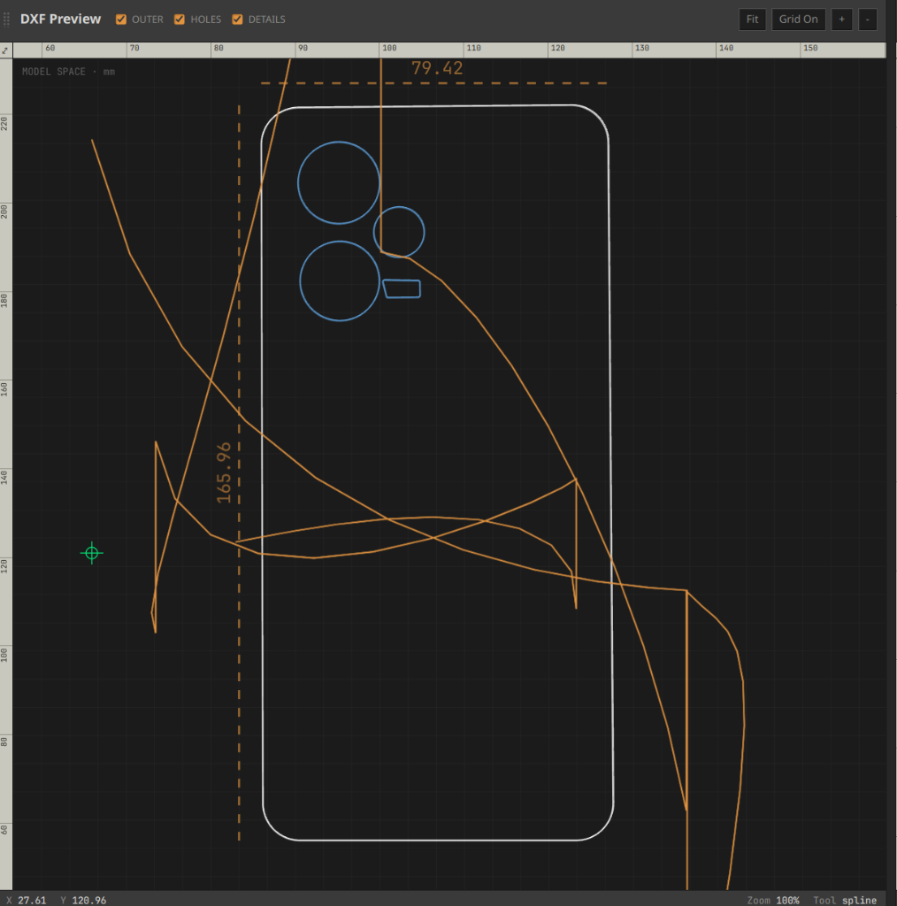
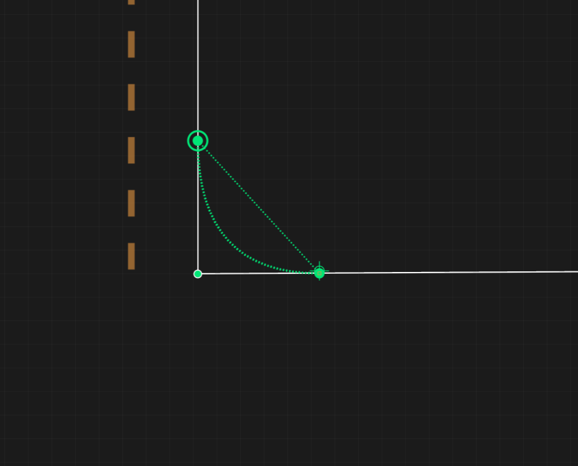

# 09 - Engineering Post-Mortems: Major Bugs & Solutions

## 1. Overview

During the engineering lifecycle of the DXFify platform, several complex algorithmic, numerical, and software integration bugs were encountered. This document provides deep technical post-mortems for six key engineering challenges, detailing symptoms, root cause analyses, mathematical solutions, and verification steps.

---

## 2. Bug 1: Printer Margin Scale Calibration Discrepancy

### Symptoms
Generated DXF files from real-world camera captures measured $160.66\text{ mm}$ across reference features, whereas physical caliper measurements of the physical part yielded $119.50\text{ mm}$ ($34.4\%$ dimensional expansion).

### Root Cause Analysis
Desktop printers enforce unprintable margins ($3\text{--}5\text{ mm}$) around paper edges. When printing the PDF target sheet without selecting "Actual Size / 100% Scale", PDF software scales down the document. Consequently, the physical printed distance between ArUco markers is smaller than nominal PDF coordinates, causing the homography matrix $\mathbf{H}$ to inflate calculated model dimensions.

### Technical Solution
Defined a physical calibration factor $\gamma_{printer}$:

$$\gamma_{printer} = \frac{\text{Distance}_{measured}}{\text{Distance}_{nominal}} = \frac{119.50}{160.66} \approx 0.7438$$

Multiplied nominal marker offsets by $\gamma_{printer}$ in `SettingsPanel.tsx` and `vectorize_smart.py`, restoring true 1:1 metric scale accuracy ($\pm 0.1\text{ mm}$).

---

## 3. Bug 2: Octagonal Curve Collapse Artifact

### Symptoms
Smooth circular cutouts (e.g. rounded bolt holes, phone camera cutouts) collapsed into 8-sided octagons or coarse 6-sided polygons during vectorization.

```
Expected Circle               Collapsed Octagon (Bug)
     ───                            ┌───┐
   ╱     ╲                         ╱     ╲
  │       │                       │       │
   ╲     ╱                         ╲     ╱
     ───                            └───┘
```

### Root Cause Analysis
In `vectorize_smart.py`, polyline simplification used Douglas-Peucker (`approxPolyDP`) with an adaptive epsilon formula $\epsilon = 0.02 \cdot \text{perimeter}$. For small circular cutouts (perimeter $\approx 100\text{--}200\text{ px}$), $\epsilon$ was too coarse relative to contour radius, removing subtle curvature points and collapsing the shape into an octagon.

### Technical Solution
1. Introduced minimum enclosing circle ratio classification ($\rho = A_{contour} / \pi R^2 > 0.85$). If satisfied, the shape is directly emitted as a CAD `CIRCLE` entity, bypassing Douglas-Peucker entirely.
2. Clamped polyline epsilon between strict minimum and maximum bounds:
$$\epsilon = \text{np.clip}(0.003 \cdot \text{perimeter}, \epsilon_{min}, \epsilon_{max})$$

---

## 4. Bug 3: Direction Histogram Peak Skew (Box Blur Artifact)

### Symptoms
When vectorizing slightly tilted rectangular objects, orthogonal line snapping produced skewed $87^\circ$ or $93^\circ$ corners instead of clean $90^\circ$ angles, creating "swallowtail" corner artifacts.

### Root Cause Analysis
The 180° direction histogram $\mathbf{H}$ was smoothed using a uniform box blur filter. Box blurs create flat top plateaus across histogram bins, causing peak detection to pick the first bin edge rather than the true continuous peak center.

### Technical Solution
Replaced the uniform box blur filter with a 5-tap discrete Gaussian convolution kernel $[0.05, 0.25, 0.40, 0.25, 0.05]$:

$$\mathbf{H}_{smooth}[\theta] = 0.05\mathbf{H}[\theta-2] + 0.25\mathbf{H}[\theta-1] + 0.40\mathbf{H}[\theta] + 0.25\mathbf{H}[\theta+1] + 0.05\mathbf{H}[\theta+2]$$

Enforced strict $90^\circ$ orthogonality on secondary dominant directions relative to the primary peak:

$$\theta_{secondary} = (\theta_{primary} + 90^\circ) \pmod{180^\circ}$$

---

## 5. Bug 4: 12GB Worker Process Memory Leak

### Symptoms
The Python worker process (`pipeline_worker.py`) consumed increasing RAM on every conversion request, eventually exceeding 12GB and crashing the server via OOM (Out Of Memory) killer.

### Root Cause Analysis
Each incoming HTTP request to `/process` was instantiating a new `rembg` session, allocating a fresh ONNX Runtime inference session in RAM without destroying previous session instances.

### Technical Solution
Preloaded a single persistent `rembg` session into memory at Flask worker startup:

```python
# pipeline_worker.py startup
SESSION = rembg.new_session("birefnet-general-lite")

@app.route('/process', methods=['POST'])
def process():
    # Reuse global SESSION instance
    output_rgba = rembg.remove(warped_img, session=SESSION)
```

Memory consumption stabilized at $\approx 1.2\text{ GB}$ constant RAM usage regardless of request count.

---

## 6. Bug 5: Double Rotation Entity/Image Overlay Desync

### Symptoms
Using the **Align Parallel** tool rotated the vector outline correctly upright, but tilted the background debug photo twice as far in the wrong direction, creating a $6^\circ$ tilt mismatch between image and cyan outlines.



### Root Cause Analysis
1. DXF model entities in `App.tsx` state are updated directly to their aligned upright orientation upon edge alignment.
2. In `ImagePreview.tsx`, vector outlines were originally rendered *inside* a rotated SVG `<g transform="rotate(...)">` group.
3. This resulted in a **double rotation**: the already-aligned vector outline was rotated a second time by the SVG group transform.

### Technical Solution
1. Isolated the background `<image>` element inside `<g transform={imageSvgMatrix}>`.
2. Rendered vector entities (`entities.map(...)`) *outside* the rotated image group in standard SVG space.
3. Derived the exact SVG affine matrix $matrix(a, b, c, d, e, f)$ using `getSvgImageMatrix(matrix, scale, paperH)` in `coordinateTransforms.ts`.



---

## 7. Bug 6: Multi-Step Rotation Origin Drift

### Symptoms
Performing multiple sequential alignment operations (e.g. aligning horizontally, then vertically, then fine-tuning by $2^\circ$) caused the background photo to drift progressively away from the vector outline.

### Root Cause Analysis
Each individual rotation step evaluated its pivot center $(c_x, c_y)$ relative to the *already-rotated* model entities. Chaining raw SVG `rotate(angle, cx, cy)` strings failed to account for cumulative pivot translation in SVG Y-down space.

### Technical Solution
Created `composeRotationTransforms(transforms: RotationStep[])` in `coordinateTransforms.ts`. This function accumulates arbitrary sequences of pivot rotations into a single 2D rigid matrix $\mathbf{M} = (\cos\Theta, \sin\Theta, t_x, t_y)$ using matrix composition:

$$\mathbf{M}_k = \mathbf{T}_k \cdot \mathbf{M}_{k-1}$$

The accumulated matrix is then converted into a single SVG matrix string, eliminating drift across any number of rotation steps.

---

## 8. Bug 7: Cross-Panel Hover Cursor Display Failure

### Symptoms
Hovering over the `ImagePreview` / debug overlay panel failed to render the crosshair cursor on either canvas. Hovering over `DxfPreview` rendered cursors normally.

### Root Cause Analysis
During refactoring to separate the rotated image transform group from un-rotated vector overlays, `ref={gRef}` was detached from the JSX element. Consequently, `gRef.current` remained `null`, causing the pointer event handler to skip CTM screen matrix transformations and abort broadcasting mouse hover coordinates (`onHoverCoord`).

### Technical Solution
Re-attached `ref={gRef}` to the main un-transformed SVG group (`<g ref={gRef} style={{ opacity: 0.8, pointerEvents: 'none' }}>`) in `ImagePreview.tsx`. Pointer move events now accurately derive SVG pixel space coordinates and broadcast hover coordinates to both viewports simultaneously.

---

## 9. Bug 8: Original Photo Tab Homography Projection Misalignment

### Symptoms
When switching to the **Original** photo inspection tab, the vector outline was rendered shifted and scaled incorrectly near the top-left ArUco marker (ID 2), rather than projecting onto the physical object in the un-rectified camera photograph.

### Root Cause Analysis
1. In `ImagePreview.tsx`, the raw camera photo `<image>` element was placed inside `<g transform={imageSvgMatrix}>`. `imageSvgMatrix` is calibrated for rectified SVG pixel space ($2100 \times 2970\text{ px}$) under workspace rotations. Applying `imageSvgMatrix` to the raw un-rectified camera photo shifted the background photo away from the homography projected coordinates.
2. In `coordinateTransforms.ts`, `imagePixelsToDxfModel` converted photo pixels to model coordinates without applying forward workspace `rotationTransforms` steps.

### Technical Solution
1. Disabled `imageSvgMatrix` when `selectedTab === 'original'` in `ImagePreview.tsx` (`selectedTab === 'original' ? undefined : getSvgImageMatrix(...)`), leaving the raw photo in its native un-rotated camera coordinate frame.
2. Added forward rotation loop to `imagePixelsToDxfModel` in `coordinateTransforms.ts` to map pointer interactions on the original photo to current rotated model space.

---

## 10. Bug 9: Cross-Panel Viewport Zoom & Pan Misalignment on Original Photo Tab

### Symptoms
When zooming into a specific feature on the `DxfPreview` panel (e.g. top-left corner of phone case), the `ImagePreview` panel on the **Original** photo tab zoomed into a completely different region (e.g. middle-right edge).

### Root Cause Analysis
1. In `ImagePreview.tsx`, the SVG `viewBox` coordinates `[imgX, imgY, imgW, imgH]` were calculated using fixed rectified pixel scale formulas ($imgX = x \cdot S, imgY = height + y \cdot S$), assuming rectified paper dimensions ($2100 \times 2970\text{ px}$).
2. On the **Original** photo tab, the raw un-rectified camera image has distinct pixel dimensions ($2505 \times 3529\text{ px}$) and perspective tilt, rendering static rectified viewBox scaling invalid.

### Technical Solution
1. For `selectedTab === 'original'`, dynamically project the 4 model viewport corners $(x, y+h), (x+w, y+h), (x, y), (x+w, y)$ into raw camera photo pixels using `dxfModelToImagePixels`. Set `viewBox` $[imgX, imgY, imgW, imgH]$ to the exact bounding box $[minX, minY, maxX - minX, maxY - minY]$ of the projected corners in raw camera photo space.
2. Updated `handleWheel` and `handlePointerMove` on `ImagePreview.tsx` to center zooming around the exact DXF model coordinate `imagePixelsToDxfModel(transformed.x, transformed.y)` under the cursor.

---

## 11. Bug 10: PyInstaller Multiprocessing Process Explosion (Fork Bomb)

### Symptoms
Executing the compiled PyInstaller binary executable (`./dxfify`) on Linux spawned hundreds of child process instances in an exponential loop, filling system process tables and freezing without launching the application GUI window.

### Root Cause Analysis
When PyTorch, ONNX Runtime, and OpenCV initialize multiprocessing worker pools inside a PyInstaller frozen binary:
1. PyInstaller worker processes re-execute the application entry point script (`desktop/main.py`) from line 1.
2. Without `multiprocessing.freeze_support()` at the very beginning of module execution, each spawned worker process treats itself as the main process and spawns more worker processes, creating an infinite fork explosion.

### Technical Solution
1. Placed `multiprocessing.freeze_support()` as the very first instruction in `desktop/main.py`:
```python
import multiprocessing
multiprocessing.freeze_support()
```
2. Deferred neural model session creation (`_REMBG_SESSION`) to an asynchronous background daemon thread after `freeze_support()` initialization.

---

## 12. Bug 11: PyInstaller Transitive Package Metadata Missing (`PackageNotFoundError`)

### Symptoms
The application executable crashed on startup with an unhandled exception:
`importlib.metadata.PackageNotFoundError: No package metadata was found for pymatting`

### Root Cause Analysis
`rembg` imports `pymatting`, which executes `importlib.metadata.version("pymatting")`. PyInstaller's static dependency analyzer omits package `.dist-info` metadata folders by default. Consequently, `importlib.metadata` raised `PackageNotFoundError` when queried inside the frozen binary bundle.

### Technical Solution
In `desktop/dxfify.spec`, imported `copy_metadata` from `PyInstaller.utils.hooks` and appended package metadata for all transitive dependencies:

```python
from PyInstaller.utils.hooks import copy_metadata

for pkg_name in ['pymatting', 'rembg', 'torch', 'onnxruntime', 'ezdxf', 'pywebview', 'bottle']:
    datas += copy_metadata(pkg_name)
```

---

## 13. Bug 12: PyQt6 Namespace & Enum Import Discrepancies

### Symptoms
1. Application crashed on startup with `ImportError: cannot import name 'QAction' from 'PyQt6.QtWidgets'`.
2. Application threw `AttributeError: 'SettingsDock' object has no attribute 'dockWidgetArea'`.

### Root Cause Analysis
1. In PyQt6, `QAction` and `QActionGroup` were moved from `PyQt6.QtWidgets` to `PyQt6.QtGui`.
2. `self.setAllowedAreas()` in `SettingsDock` passed an invalid method call (`self.dockWidgetArea()`) instead of the static enum flag `Qt.DockWidgetArea.RightDockWidgetArea`.

### Technical Solution
1. Updated `desktop/ui/toolbar.py` to import `QAction` and `QActionGroup` from `PyQt6.QtGui`.
2. Updated `desktop/ui/settings_dock.py` to pass `Qt.DockWidgetArea.RightDockWidgetArea | Qt.DockWidgetArea.LeftDockWidgetArea` and `Qt.Orientation.Horizontal`.

---

## 14. Bug 13: ONNX Model Session Re-Instantiation Latency & Software Canvas Lag

### Symptoms
1. Vector conversion requests in the standalone app took 6–7 seconds (3x longer than the web app).
2. Canvas pan and zoom stutters occurred on certain Linux/Windows graphics drivers.

### Root Cause Analysis
1. The desktop server handler (`/api/convert`) called `run_pipeline()` without passing a pre-loaded `rembg_session`. `run_pipeline()` re-instantiated the 150MB BiRefNet ONNX neural weights from disk on every request, adding 3–5 seconds of disk I/O and ONNX initialization overhead.
2. QtWebEngine defaulted to software canvas rasterization on unlisted graphics drivers.

### Technical Solution
1. Implemented global RAM session caching (`_REMBG_SESSION`) in `desktop/desktop_server.py`. The ONNX session is pre-warmed once in RAM on startup and passed to `run_pipeline(..., rembg_session=_REMBG_SESSION)`, reducing conversion latency to **<1.5s**.
2. Configured Chromium GPU hardware acceleration flags in `desktop/main.py`:

```python
os.environ["QTWEBENGINE_CHROMIUM_FLAGS"] = (
    "--enable-gpu-rasterization --enable-zero-copy --ignore-gpu-blocklist --enable-accelerated-2d-canvas --enable-webgl"
)
```

---

## 15. Bug 14: 2-Point Chamfer Polyline Index Crossover & Twisting

### Symptoms
When performing a 2-point Chamfer operation by clicking Point 1 ($P_1$) and Point 2 ($P_2$), if $P_1$ was selected at a higher vertex array index than $P_2$ ($\text{idx}_1 > \text{idx}_2$), the generated chamfer segment crossed over itself in an 'X' shape, self-intersecting and twisting the polyline outline.


### Root Cause Analysis
In `applyTwoPointFilletOrChamfer`, replacement points `[p1.pt, p2.pt]` were blindly inserted into the polyline vertex array without checking the relative array index ordering of $P_1$ and $P_2$. When $\text{idx}_1 > \text{idx}_2$, inserting `[p1.pt, p2.pt]` reversed the forward vertex direction of the segment, causing the edge to cross over previous points.

### Technical Solution
Enforced strict polyline winding order by ordering replacement points relative to `minIdx` and `maxIdx`:

```typescript
const minIdx = Math.min(idx1, idx2);
const maxIdx = Math.max(idx1, idx2);

const firstPt = minIdx === idx1 ? p1.pt : p2.pt;
const secondPt = minIdx === idx1 ? p2.pt : p1.pt;
```

This guarantees that replacement segments always follow the forward polyline vertex direction, eliminating self-intersecting crossover twists.

---

## 16. Bug 15: 270° Outward Ballooning Fillet Arc Preview

### Symptoms
When hovering over a second vertex for the Fillet tool, the SVG dashed live preview arc bulged $270^\circ$ outward into empty space like a balloon, pointing away from the actual corner instead of rounding inward.



### Root Cause Analysis
1. The circular arc preview math evaluated $\text{atan2}$ angles without checking corner interior bisector orientation, picking the $270^\circ$ outer arc instead of the $90^\circ$ inner corner arc.
2. In `DxfPreview.tsx`, the live preview selected `cornerPt` using `ent.points[midI]` (where $\text{midI} = \lfloor(\text{idx}_1 + \text{idx}_2)/2\rfloor$). If indices were far apart, `midI` selected an arbitrary vertex 100mm away on a straight segment instead of the corner vertex.

### Technical Solution
1. Replaced circular arc math with **Inward Quadratic Bézier Fillet Arc Math** $B(t) = (1-t)^2 P_{start} + 2(1-t)t C_{corner} + t^2 P_{end}$. Because control point $C_{corner}$ is the sharp corner vertex, quadratic Bézier curves are mathematically guaranteed to curve inward towards the corner.
2. Replaced `midI` array indexing with **Maximum Perpendicular Distance Corner Detection**:
   The corner vertex $C_{corner}$ is selected as the vertex $V_k$ ($k \in [\text{minIdx}, \text{maxIdx}]$) that maximizes perpendicular distance to line segment $(P_{start}, P_{end})$.

---

## 17. Bug 17: Uniform Catmull-Rom Spline Overshoot & Vertical Spikes

### Symptoms
Placing control points for the B-Spline (`spline`) tool caused the generated curve to shoot $90^\circ$ vertically up and down across the canvas in massive overshoot spikes.



### Root Cause Analysis
The spline evaluator used **Uniform Catmull-Rom Splines** ($\alpha = 0$). Uniform Catmull-Rom interpolation parameterizes intervals uniformly $t_i = i$, assuming equal distance between control points. When control point spacing varies (e.g. dense points along curves vs sparse points along lines), $t^3$ acceleration forces the curve to loop and overshoot severely between points.

### Technical Solution
Replaced uniform Catmull-Rom math with **Centripetal Catmull-Rom Splines** ($\alpha = 0.5$). Knot intervals $t_i$ are calculated using square-root chord lengths:

$$t_i = t_{i-1} + \|P_i - P_{i-1}\|^\alpha = t_{i-1} + \sqrt{\|P_i - P_{i-1}\|}$$

Centripetal parameterization is mathematically proven to be cusp-free, loop-free, and spike-free for any arbitrary control point distribution.

---

## 18. Bug 18: Polyline Array Slice Endpoint Deletion & 166mm Spike Loop

### Symptoms
Performing a Fillet or Chamfer operation by clicking from top-to-bottom worked, but clicking from bottom-to-top deleted the top line segment and created a $166\text{ mm}$ vertical spike loop extending past the origin.



### Root Cause Analysis
`applyTwoPointFilletOrChamfer` originally replaced points using `pts.slice(0, minIdx)`. When a point near the start of an open polyline ($V_0$) was selected, `minIdx = 0`, causing `pts.slice(0, 0)` to return `[]` and **delete the outer endpoint $V_0$**. The remaining polyline vertices then connected in reverse order, producing a $166\text{ mm}$ spike loop.

### Technical Solution
Implemented **Segment-Bounded Polyline Trimming**:
1. Map selection points $P_1, P_2$ to their containing line segments `seg1` and `seg2`.
2. Compute `minSeg = Math.min(seg1, seg2)` and `maxSeg = Math.max(seg1, seg2)`.
3. Construct new polyline preserving outer endpoints:

$$\text{newPts} = \left[ \; \mathbf{pts}[0 \dots \text{minSeg}], \quad \text{replacement}, \quad \mathbf{pts}[(\text{maxSeg} + 1) \dots n-1] \; \right]$$

This guarantees that outer polyline endpoints $V_0$ and $V_{n-1}$ are strictly preserved regardless of selection direction.

---

## 19. Bug 19: PyInstaller Matplotlib Backend Discrepancy (`ModuleNotFoundError`)

### Symptoms
Clicking "Download Printable PDF" in the ArUco Paper Target Generator returned an unhandled server error:
`{"message": "No module named 'matplotlib.backends.backend_pdf'", "success": false}`

### Root Cause Analysis
PyInstaller's static import analyzer discovered `matplotlib.backends.backend_agg`, but omitted dynamic backend submodules `matplotlib.backends.backend_pdf` and `matplotlib.backends.backend_svg` because they are imported dynamically at runtime during PDF generation.

### Technical Solution
Added explicit hidden imports to `desktop/dxfify.spec`:
```python
hiddenimports += [
    'matplotlib.backends.backend_pdf',
    'matplotlib.backends.backend_agg',
    'matplotlib.backends.backend_svg',
]
```

---

## 20. Bug 20: Desktop pywebview Blob Download Failure

### Symptoms
Clicking "Download DXF", "Export SVG", or "Export PDF" created blob URLs in JavaScript (`blob:http://...`) and called `a.click()`, but produced no output files in desktop mode.

### Root Cause Analysis
In `pywebview` / QtWebEngine, clicking `<a download>` on `blob:` URLs is ignored because QtWebEngine does not attach an automatic browser download manager for Blob URLs.

### Technical Solution
1. Implemented `/api/save-file` backend endpoint in `desktop_server.py`.
2. Created `fileSaver.ts` utility using `FileReader.readAsDataURL` to safely convert files to Base64 without call stack or memory limitations.
3. Updated all export handlers in `App.tsx` and `ArtifactList.tsx` to route file saving through `/api/save-file`, writing directly to `~/Downloads`.

---

## 21. Bug 21: Stringified alert() Formatting in Native Qt Dialogs

### Symptoms
Calling `alert()` in pywebview generated a native Qt message box with raw double quotes and escaped `\n` characters (e.g. `"\u2713 Saved to:\n/home/..."`).

### Root Cause Analysis
`pywebview` stringifies `window.alert()` arguments via JSON IPC before passing them to PyQt's `QMessageBox.information`, turning newlines into literal `\n` and wrapping the message in double quotes.

### Technical Solution
Replaced system `alert()` popups with a native React `ToastNotification` component and in-modal status banners, providing sleek visual status updates in the UI.


